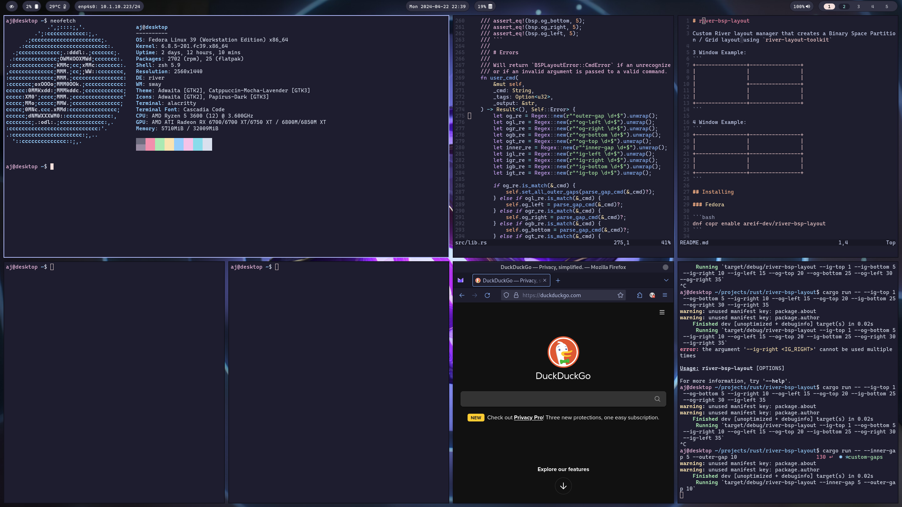
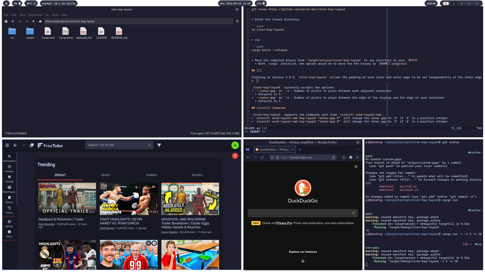
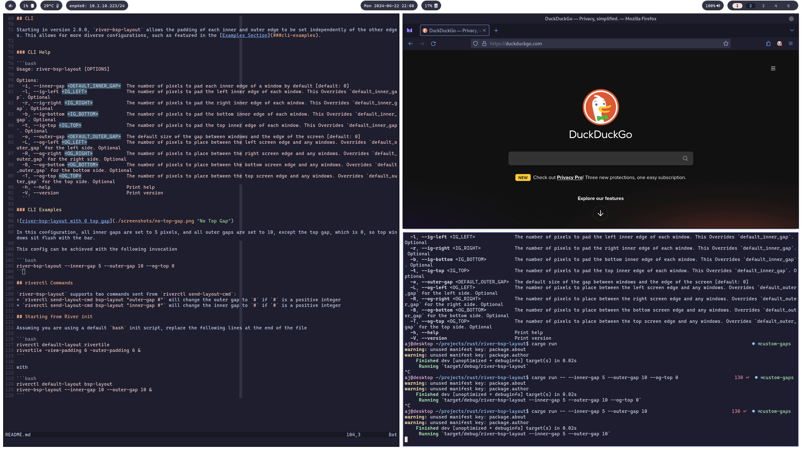
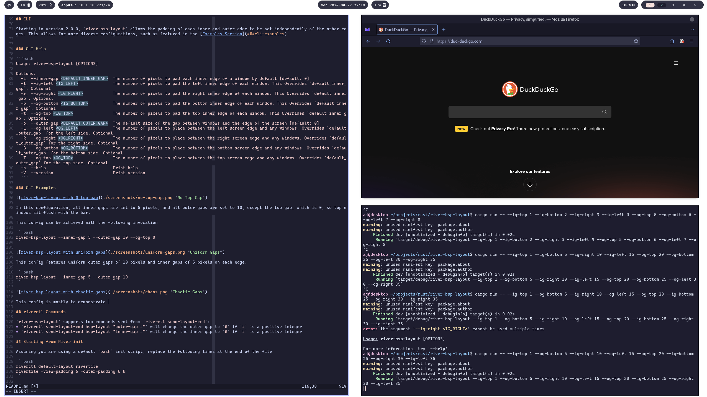
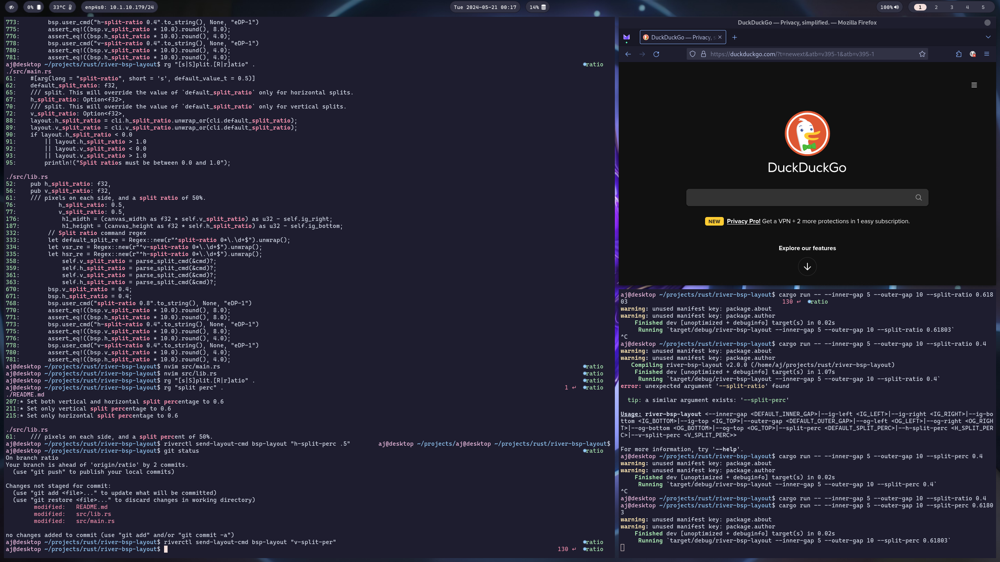

# river-bsp-layout

[](https://docs.rs/river-bsp-layout)
[](https://crates.io/crates/river-bsp-layout)



Layout manager for [river-classic](https://codeberg.org/river/river-classic) that creates a Binary Space Partition / Grid layout using `river-layout-toolkit`

## Important Notes on River 0.4.0

Future versions of River will introduce breaking changes with the current layout manager paradigm, meaning that existing River layout managers (including `river-bsp-layout`) will no longer work on River versions past and including v0.4.0. 

[ifreund](https://codeberg.org/ifreund) continues to maintain a hard fork of River version 0.3.x at https://codeberg.org/river/river-classic, where `river-bsp-layout` and other layout managers will continue to function as intended indefinitely. 

I make no promises that I will implement the new `river_window_management_v1` protocol. If I do, it will take a good bit of time, and will be under a new project entirely.

3 Window Example:
```
+----------------+----------------+
|                |                |
|                |                |
|                +----------------+
|                |                |
|                |                |
+----------------+----------------+
```

4 Window Example:
```
+----------------+----------------+
|                |                |
|                |                |
+----------------+----------------+
|                |                |
|                |                |
+----------------+----------------+
```

## Installing 

### Fedora 

```bash 
dnf copr enable areif-dev/river-bsp-layout
```

```bash 
dnf install river-bsp-layout
```

### NixOS 

```nix 
# configuration.nix 

environment.systemPackages = with pkgs; [
  # Other packages ...
  river-bsp-layout
];
```

### Other - Cargo 

```bash
cargo install river-bsp-layout --locked
```

## Building

* Make sure you have `cargo` installed. The recommended means of installation is with `rustup.sh` from https://www.rust-lang.org/tools/install
* Clone this repo with 

```bash
git clone https://github.com/areif-dev/river-bsp-layout
```

* Enter the cloned directory 

```bash
cd river-bsp-layout
```

* run 

```bash
cargo build --release
```

* Move the compiled binary from `target/release/river-bsp-layout` to any directory in your `$PATH`
  * With `cargo` installed, one option would be to move the the binary to `$HOME/.cargo/bin`

## Starting from River init

Assuming you are using a default `bash` init script, replace the following lines at the end of the file

```bash
riverctl default-layout rivertile
rivertile -view-padding 6 -outer-padding 6 &
```

with 

```bash
riverctl default-layout bsp-layout
river-bsp-layout --inner-gap 5 --outer-gap 10 --split-perc 0.5 &
```

## CLI Help

```bash 
Usage: river-bsp-layout [OPTIONS]

Options:
  -h, --help     Print help
  -V, --version  Print version

Inner Gap Options:
  -i, --inner-gap <DEFAULT_INNER_GAP>  The number of pixels to pad each inner edge of a window by default [default: 0]
  -l, --ig-left <IG_LEFT>              The number of pixels to pad the left inner edge of each window. This Overrides `default_inner_gap`. Optional
  -r, --ig-right <IG_RIGHT>            The number of pixels to pad the right inner edge of each window. This Overrides `default_inner_gap`. Optional
  -b, --ig-bottom <IG_BOTTOM>          The number of pixels to pad the bottom inner edge of each window. This Overrides `default_inner_gap`. Optional
  -t, --ig-top <IG_TOP>                The number of pixels to pad the top inner edge of each window. This Overrides `default_inner_gap`. Optional

Outer Gap Options:
  -o, --outer-gap <DEFAULT_OUTER_GAP>  The default size of the gap between windows and the edge of the screen [default: 0]
  -L, --og-left <OG_LEFT>              The number of pixels to place between the left screen edge and any windows. Overrides `default_outer_gap` for the left side. Optional
  -R, --og-right <OG_RIGHT>            The number of pixels to place between the right screen edge and any windows. Overrides `default_outer_gap` for the right side. Optional
  -B, --og-bottom <OG_BOTTOM>          The number of pixels to place between the bottom screen edge and any windows. Overrides `default_outer_gap` for the bottom side. Optional
  -T, --og-top <OG_TOP>                The number of pixels to place between the top screen edge and any windows. Overrides `default_outer_gap` for the top side. Optional

Split Options:
  -s, --split-perc <DEFAULT_SPLIT_PERC>  The default percentage of available area that the primary window should occupy after any split takes place [default: 0.5]
  -H, --hsplit-perc <HSPLIT_PERC>        The percentage of available area that the primary window should occupy after a horizontal split. This will override the value of `default_split_perc` only for
                                         horizontal splits
  -v, --vsplit-perc <VSPLIT_PERC>        The percentage of available area that the primary window should occupy after a vertical split. This will override the value of `default_split_perc` only for vertical
                                         splits
      --start-hsplit                     Whether the first split that's made should divide the screen horizontally. If this is not set, then the first split will be vertical

Other Options:
      --reverse  Reverse the order of the views as well as the order they are added
```

## CLI Examples



In this configuration, all inner gaps are set to 5 pixels, and all outer gaps are set to 10, except the top gap, which is 0, so top windows sit flush with the bar. 

This config can be achieved with the following invocation

```bash 
river-bsp-layout --inner-gap 5 --outer-gap 10 --og-top 0
```



This config features uniform outer gaps of 10 pixels and inner gaps of 5 pixels on each edge. 

```bash 
river-bsp-layout --inner-gap 5 --outer-gap 10
```



This config is mostly to demonstrate the possibilities of individually configurable edge gaps. 

```bash 
river-bsp-layout --ig-top 1 --og-bottom 5 --ig-right 10 --og-left 15 --og-top 20 --ig-bottom 25 --og-right 30 --ig-left 35
```



This run demonstrates the ability to split the screen into unequal chunks whenever a split takes place. This allows for greater focus to be put on your primary window(s)

```bash 
river-bsp-layout --inner-gap 5 --outer-gap 10 --split-perc 0.61803
```

## Riverctl User Commands

For the most part, you can pass the same options to `riverctl send-layout-cmd` that you would send to bsp-layout when starting it initially. However, some additional `riverctl` options exist, such as `--start-vsplit`, which will set a vertical split as the primary split. 

Addtionally, there are the options `--(inc|dec)-(h|v)split`, which will allow you to add or subtract a given amount from the current split percentage. This command can be useful to temporarily draw more focus to a particular window, and is very handy when bound to a keybind.

Finally, the `--reverse` option -- while not new -- does behave slightly differently to the cli option of the same name. The cli behavior is to cause new views to be rendered to the right and bottom side of the screen, whereas the user cmd option will flip the stack to the opposite of what the existing state is everytime it's called. 

Unlike in previous versions of bsp-layout where only one command could be parsed at a time, versions 2.1.0 and forward are able to parse almost any combination of options passed at once. The only exception to this being `--start-vsplit` and `--start-hsplit`, which are mutually exclusive with each other.

```bash 
Usage: riverctl send-layout-cmd bsp-layout [OPTIONS]

Inner Gap Options:
  -i, --inner-gap <DEFAULT_INNER_GAP>
          The number of pixels to pad each inner edge of a window by default

  -l, --ig-left <IG_LEFT>
          The number of pixels to pad the left inner edge of each window. This Overrides `default_inner_gap`. Optional

  -r, --ig-right <IG_RIGHT>
          The number of pixels to pad the right inner edge of each window. This Overrides `default_inner_gap`. Optional

  -b, --ig-bottom <IG_BOTTOM>
          The number of pixels to pad the bottom inner edge of each window. This Overrides `default_inner_gap`. Optional

  -t, --ig-top <IG_TOP>
          The number of pixels to pad the top inner edge of each window. This Overrides `default_inner_gap`. Optional

Outer Gap Options:
  -o, --outer-gap <DEFAULT_OUTER_GAP>
          The default size of the gap between windows and the edge of the screen

  -L, --og-left <OG_LEFT>
          The number of pixels to place between the left screen edge and any windows. Overrides `default_outer_gap` for the left side. Optional

  -R, --og-right <OG_RIGHT>
          The number of pixels to place between the right screen edge and any windows. Overrides `default_outer_gap` for the right side. Optional

  -B, --og-bottom <OG_BOTTOM>
          The number of pixels to place between the bottom screen edge and any windows. Overrides `default_outer_gap` for the bottom side. Optional

  -T, --og-top <OG_TOP>
          The number of pixels to place between the top screen edge and any windows. Overrides `default_outer_gap` for the top side. Optional

Split Options:
  -s, --split-perc <DEFAULT_SPLIT_PERC>
          The default percentage of available area that the primary window should occupy after any split takes place

  -H, --hsplit-perc <HSPLIT_PERC>
          The percentage of available area that the primary window should occupy after a horizontal split. This will override the value of `default_split_perc` only for horizontal splits

  -v, --vsplit-perc <VSPLIT_PERC>
          The percentage of available area that the primary window should occupy after a vertical split. This will override the value of `default_split_perc` only for vertical splits

      --start-hsplit
          Set the first split to horizontal. Mutually exclusive with `--start-vsplit`

      --start-vsplit
          Set the first split to vertical. Mutually exclusive with `--start-hsplit`

      --inc-hsplit <INC_HSPLIT>
          Increase the hsplit percentage by a certain amount

      --inc-vsplit <INC_VSPLIT>
          Increase the vsplit percentage by a certain amount

      --dec-vsplit <DEC_VSPLIT>
          Decrease the vsplit percentage by a certain amount

      --dec-hsplit <DEC_HSPLIT>
          Decrease the hsplit percentage by a certain amount

Other Options:
      --reverse
          Reverse the order of the views as well as the order they are added
```

## User Commands Examples 

* Flip the orientation of the stack and set all inner gaps to be 5 pixels wide 
```bash 
riverctl send-layout-cmd bsp-layout "--reverse -i 5"
```

* Map a keybind to increase the vertical split percentage by a small amount 
```bash 
riverctl map normal $MOD+Shift L send-layout-cmd bsp-layout "--inc-vsplit .005"
```

* Set the first split of the stack to be horizontal
```bash 
riverctl send-layout-cmd bsp-layout "--start-hsplit"
```
